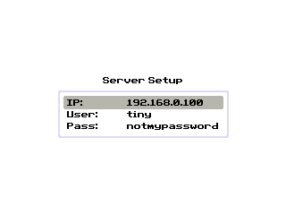
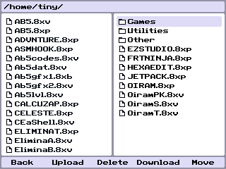

# lwFTP CE

lwFTP CE is a simple FTP client for the TI-84 Plus CE, based on [gezedo's lwFTP client](https://github.com/gezedo/lwftp) and the [lwIP-CE port by CagsCalcLabs](https://github.com/cagscalclabs/lwip-ce). It supports uploading / downloading, moving, deleting, and renaming files.

## Screenshots

 

## Installation

1. Download the latest version of lwFTP CE from [the GitHub releases page](https://github.com/tiny-hacker/lwftp-ce/releases/latest).
2. Send **APPINST.8xp**, **AppInstA.8xv**, **AppInstB.8xv**, and **AppInstC.8xv** to your calculator using TI-Connect CE or another linking program of your choice. If you don't have the [CE C libraries](https://tiny.cc/clibs), you'll need to download and send those as well.
3. Run **prgmAPPINST** from the programs menu (You will need to use the [arTIfiCE jailbreak](https://yvantt.github.io/arTIfiCE) if you are on an OS version 5.5 and above).
4. lwFTP CE will be installed and can be found in the apps menu.

## Usage

In order to use lwFTP CE, you will also need an FTP server to connect to. Many FTP server programs are available, though lwFTP CE relies on a server which supports RFC 3659 as it uses the MLSD command. You'll also need a USB -> Ethernet adapter. 

When opening lwFTP from the calculator's apps menu, you'll be prompted to configure the server information. Use arrow keys to navigate, <kbd>2nd</kbd> to modify / save options, <kbd>alpha</kbd> to toggle input modes, <kbd>del</kbd> for backspace, and <kbd>enter</kbd> to apply the configuration.

In the main file explorer interface, use <kbd>2nd</kbd> to enter directories and the arrow keys to move the cursor. Use the function keys to perform the operations shown at the bottom of the screen (back to previous directory, upload, delete, download, move).

## Themes

If [CEaShell](https://github.com/RoccoLoxPrograms/CEaShell/) is present on your calculator, lwFTP CE will sync its color scheme with the one used by CEaShell.

## Credits
- [lwIP-CE port by CagsCalcLabs](https://github.com/cagscalclabs/lwip-ce)
- [lwFTP by gezedo](https://github.com/gezedo/lwftp)

© 2026 TIny_Hacker
